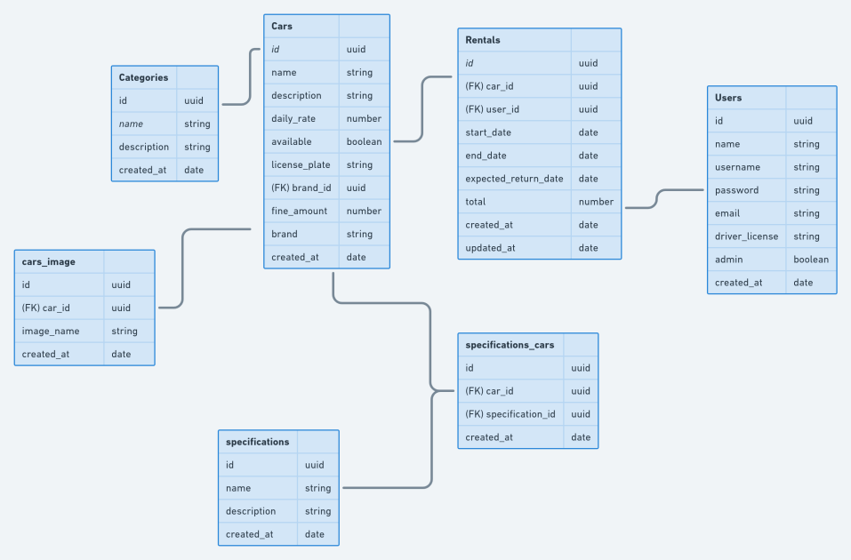

<h1 align="center">
    
</h1>

<p align="center">
  

  

  <a href="https://github.com//leocairos/ignite-nodejs-typescript/commits/master">
    
  </a>

  
   <a href="https://github.com/leocairos/ignite-nodejs-typescript/stargazers">
    
  </a>

  <a href="https://www.linkedin.com/in/leonardo-sampaio-cairo-54a74756/">
    
  </a>
</p>

# 🚀 Sobre

O Ignite é um programa de aceleração para devs desenvolvido pela [Rocketseat](https://rocketseat.com.br/).


## 💻 Sobre o ...

### Diagrama de entidades e relaciomanentos do projeto

<h1 align="center">
    
</h1>

## Project Initialize/Configuration

* criar pasta para o projeto; acessar pasta criada
  ```bash
  mkdir project
  cd project
  ```

* inicializar um projeto e adicionar o pacote do express (e seus types, types como dependencia de desenvolvimento)
  ```bash
  yarn init -y
  yarn add express
  yarn add -D @types/express
  ```

* instalar typescript como dependencia de desenvolvimento
  ```bash
  yarn add -D typescript
  ```
* inicializar o typescript no projeto
  ```bash
  yarn tsc --init
  ```

* Configure outDir in tsconfig.json file
  ```JSON
  "outDir": "./dist",
  ```
* Compile server.ts file. Generate JS file by TS file.
  ```bash
  yarn tsc
  ```

* Install ts-node-dev
  ```bash
  yarn add -D ts-node-dev
  ```

* configure package.json, include script
  ```JSON
  "scripts": {
    "dev": "ts-node-dev --transpile-only --ignore-watch node_modules --respawn src/server.ts"
  },
  ```

* desabilitar o strict no tsconfig (trantamento já é realizado pelo typescript/eslint)
  ```json
  // "strict": true,                                 /* Enable all strict type-checking options. */
  ```

## Configure ESLint and Prettier

[Rocketseat Instruction](https://www.notion.so/ESLint-e-Prettier-Trilha-Node-js-d3f3ef576e7f45dfbbde5c25fa662779#eaf6e8bdcabc4d809cdae302e29750da)

* Install ESLint VSCode plugin [https://marketplace.visualstudio.com/items?itemName=dbaeumer.vscode-eslint]

* Fazer o **VSCode** formatar o código sempre que salvarmos algum arquivo (edit settings.json):
  ```json
  "editor.codeActionsOnSave": {
    "source.fixAll.eslint": true
  }
  ```

* instalar o **Eslint** como uma dependência de desenvolvimento
  ```bash
  yarn add eslint -D
  ```

* inicializar o **eslint**
  ```bash
  yarn eslint --init
  ```

    **1 - How would you like do use Eslint?** `To check syntax, find problems and enforce code style`

    **2 - What type of modules does your project use?** `Javascript modules (import/export)`

    **3 - Which framework does your project use?** `None of these`

    **4 - Does your project use TypeScript?** `Yes`

    **5 - Where does your code run?** tecla `Espaço` para desmarcar o **Browser** e selecionarmos a opção `Node`

    **6 - How would you like to define a style for your project?** `Use a popular style guide`

    **7 - Which style guide do you want to follow?** `Airbnb`

    **8 - What format do you want your config file to be in?** `JSON`

    **9 - Would you like to install them now with npm?** `No`


```bash
Checking peerDependencies of eslint-config-airbnb@latest
The config that you've selected requires the following dependencies:

@typescript-eslint/eslint-plugin@latest eslint-config-airbnb-base@latest
eslint@^5.16.0 || ^6.8.0 || ^7.2.0 eslint-plugin-import@^2.22.1
@typescript-eslint/parser@latest
? **Would you like to install them now with npm?** No
```

Para adicionar manualmente as dependências, basta seguir os passos abaixo:

- Iniciar o comando com `yarn add` para instalar as dependências e a tag `-D` para adicioná-las como desenvolvimento;

- Copiar os pacotes listados [acima](https://www.notion.so/ESLint-822d59afeafc47e39527be8cabb80b00) removendo o `eslint@^5.16.0 || ^6.8.0 || ^7.2.0` pois já temos o **ESLint** instalado.

O comando final deve ter essa estrutura :

**Não copie o comando abaixo. Utilize isso apenas como exemplo, pois as versões podem mudar**

```bash
yarn add -D @typescript-eslint/eslint-plugin@latest eslint-config-airbnb-base@latest eslint-plugin-import@^2.22.1 @typescript-eslint/parser@latest
```

* instalar um plugin que irá nos auxiliar a organizar a ordem dos imports dentro dos arquivos e outro para permitir importações de arquivos TypeScript sem que precisemos passar a extensão do arquivo:

```bash
yarn add -D eslint-plugin-import-helpers eslint-import-resolver-typescript
```

Com as dependências instaladas vamos criar na raiz do projeto um arquivo `.eslintignore` com o conteúdo abaixo para ignorar o Linting em alguns arquivos:

```
/*.js
node_modules
dist
```

* configurar o arquivo `.eslintrc.json` :

```json
{
    "env": {
        "es2021": true,
        "node": true,
        "jest": true
    },
    "extends": [
        "airbnb-base",
        "plugin:@typescript-eslint/recommended",
        "prettier",
        "plugin:prettier/recommended"
    ],
    "parser": "@typescript-eslint/parser",
    "parserOptions": {
        "ecmaVersion": 12,
        "sourceType": "module"
    },
    "plugins": [
        "@typescript-eslint",
        "eslint-plugin-import-helpers",
        "prettier"
    ],
    "rules": {
      "prettier/prettier": "error",
      "camelcase": "off",
      "import/no-unresolved": "error",
      "@typescript-eslint/naming-convention": [
        "error",
        {
          "selector": "interface",
          "format": ["PascalCase"],
          "custom": {
            "regex": "^I[A-Z]",
            "match": true
          }
        }
      ],
      "class-methods-use-this": "off",
      "import/prefer-default-export": "off",
      "no-shadow": "off",
      "no-console": "off",
      "no-useless-constructor": "off",
      "no-empty-function": "off",
      "lines-between-class-members": "off",
      "import/extensions": [
        "error",
        "ignorePackages",
        {
          "ts": "never"
        }
      ],
      "import-helpers/order-imports": [
        "warn",
        {
          "newlinesBetween": "always",
          "groups": ["module", "/^@shared/", ["parent", "sibling", "index"]],
          "alphabetize": { "order": "asc", "ignoreCase": true }
        }
      ],
      "import/no-extraneous-dependencies": [
        "error",
        { "devDependencies": ["**/*.spec.js"] }
      ]
    },
    "settings": {
      "import/resolver": {
        "typescript": {}
      }
    }
}

```

* remover a extensão **Prettier - Code Formatter** do VS Code

* instalação dos pacotes do Prettier no projeto:

```bash
yarn add prettier eslint-config-prettier eslint-plugin-prettier -D
```

* create prettier file
  ```javascript
  module.exports = {
    singleQuote: true,
    trailingComma: 'all',
    arrowParens: 'avoid',
  };
  ```
* Para padronizar o tipo de quebra de linha usada pelo VS Code no Windows, iremos instalar uma extensão chamada **[EditorConfig for VS Code](https://marketplace.visualstudio.com/items?itemName=EditorConfig.EditorConfig)**. Com ela instalada, na pasta raiz dos nossos projetos podemos clicar com o botão direito do mouse e escolher a opção `Generate .editorconfig`:

Para finalizar e aplicar todas as mudanças vamos fechar o VS Code e reabrir na **pasta raiz** do projeto, pois senão o **ESLint** não vai reconhecer as dependências instaladas e aplicar as regras de Linting.

Feito isso, para verificar se está realmente funcionando basta reabrir qualquer arquivo do projeto e tentar errar algo no código para que ele mostre o erro e formate automaticamente quando o arquivo for salvo.

## Debug instructions

* Na barra de menus na lateral esquerda do vscode clicar no icone de debug
* Clicar em "create a launch.json file"
* escolhe node
* editar launch.json
  ```JSON
  {
      // Use IntelliSense to learn about possible attributes.
      // Hover to view descriptions of existing attributes.
      // For more information, visit: https://go.microsoft.com/fwlink/?linkid=830387
      "version": "0.2.0",
      "configurations": [
          {
              "type": "node",
              "request": "attach",
              "name": "Launch Program",
              "skipFiles": ["<node_internals>/**"],
              "outFiles": ["${workspaceFolder}/**/*.js"]
          }
      ]
  }
  ```
* Editar scrip de inicialização (package.json) com o paramentro --inspect


## Documentando a API - by [SWAGGER](https://swagger.io/)

* Install swagger-ui-express

* Adjust tsconfig.json
  ```json
    ...
    "resolveJsonModule": true
  ```

* run project and open API Doc in http://[addressServer]:[portServer]/[api-doc-route-path] (ex: http://localhost:3333/api-docs)


## Docker

* Install docker: Instruction in (https://www.notion.so/Docker-e-Docker-Compose-16771f2ceefe4a05a8c29df4ca49e97a)
* Install Docker Plugin for vscode
* Create Dockerfile file in root path project
* Create .dockerignore file in root path project

* Build a docker image file (run in root path project)
  ```bash
  docker build -t rentx .
  ```

* List Docker Containers command: $ docker ps

* Run Docker Container
  ```bash
  docker run -p 3333:3333 rentx
  ```

* Open container in Bash: $ docker exec -it 16b7ec28f7b0 /bin/bash

* DOCKER COMPOSE
  * Create a docker-compose.yml file
  * run compose: $ docker-compose up (with -d to background run)
  * Logs: $ docker logs rentx
  * Added --poll parameter in package.json script

### Docker Commands

* List containers running: docker ps
* List all containers running/stoppeds: docker ps -a
* Remove container: docket rm ID-CONTAINER
* Start container: docker start ID-CONTAINER
* Stop container: docker stop ID-CONTAINER
* View app logs in docker: docker logs ID-CONTAINER
* View app logs in docker real time: docker logs ID-CONTAINER -f
* Open container in Bash: docker exec -it ID-CONTAINER /bin/bash

* Commands by docker-compose.yml file:
  * Create and run app: docker-compose up
  * Create and run app in background mode: docker-compose up -d
  * Run app only: docker-compose start
  * Stop container: docker-compose stop
  * Remover container: docker-compose down


## 📝 Licença

Este projeto esta sob a licença MIT.

Feito com ❤️ por [Leonardo Cairo](https://www.linkedin.com/in/leonardo-sampaio-cairo-54a74756/)!
